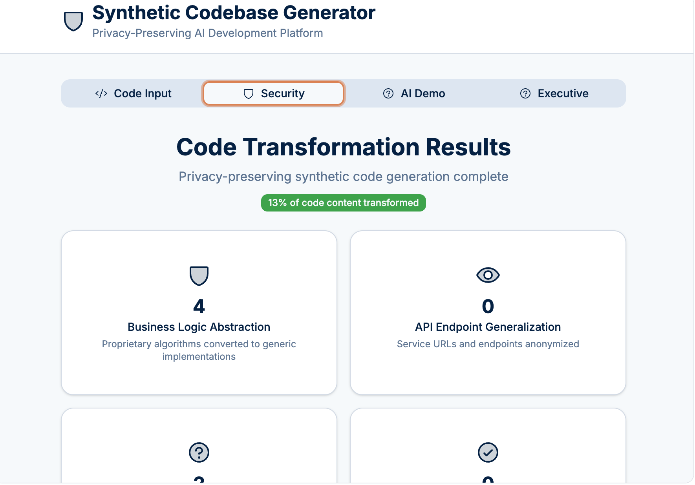

# Differentially Private Synthetic Codebase Generator 

A proof-of-concept prototype exploring the application of **Differential Privacy** principles to source code, abstracting sufficiently from an original codebase to preserve privacy and security while simultaneously maintaining sufficient similarity to be practically useful as context for ingestion by AI tools.

---

## Differential Privacy for Source Code

This project explores an architecture that applies the principles of Differential Privacy to solve a challenge. The **Privacy-Preserving Synthetic Codebase Generator** analyzes a private codebase and generates a synthetic version that is *differentially private*.

`[Private Enterprise Codebase]` → `[DP-Enabled SYNTHETIC GENERATOR]` → `[Differentially Private Synthetic Code]` → `[External LLM]`

In this model, the transformation process acts as the differential privacy mechanism. It introduces 'noise' through abstraction, generalization, and structural anonymization. The result is a synthetic codebase where the utility (the overall architecture) is preserved, while making it computationally infeasible for an observer (like an LLM) to determine whether any single piece of proprietary logic was present in the original source.

### An Analogy to Classic Differential Privacy

In traditional Differential Privacy, an algorithm's output should not reveal whether any single person's data was included in the input dataset. Applying this concept to code:

* **The Dataset:** The entire enterprise codebase.
* **An Individual:** A single piece of proprietary information (e.g., a specific function's logic, a secret key, a revealing variable name).

This generator ensures that its output—the synthetic code—remains substantially the same whether or not any one of these "individuals" is included in the original. 

---

## Key Features & Goals

* **Differential Privacy by Design:** The core transformation is built to ensure the synthetic output does not leak information about individual proprietary functions, variables, or constants.
* **High Utility:** While ensuring privacy, the generator's primary goal is to preserve the high-level architectural patterns, control flow, and data structures that are essential for an LLM to generate useful, context-aware code.
* **Tunable Privacy-Utility Trade-off:** (Future Goal) Allow users to adjust the level of abstraction ("noise") to find the right balance between privacy guarantees and the fidelity of the synthetic output.
* **Model Agnostic:** The resulting differentially private code can be used as context for any external or internal LLM.

---

## Project Status: A Thought Experiment

This repo contains a proof-of-concept. It is not a mathematically rigorous, production-ready implementation of Differential Privacy. It's a thought experiment designed to explore how privacy-preserving concepts can be translated to the domain of software engineering.

---

## [Simulation](https://gh.io/synthetic-diff)
